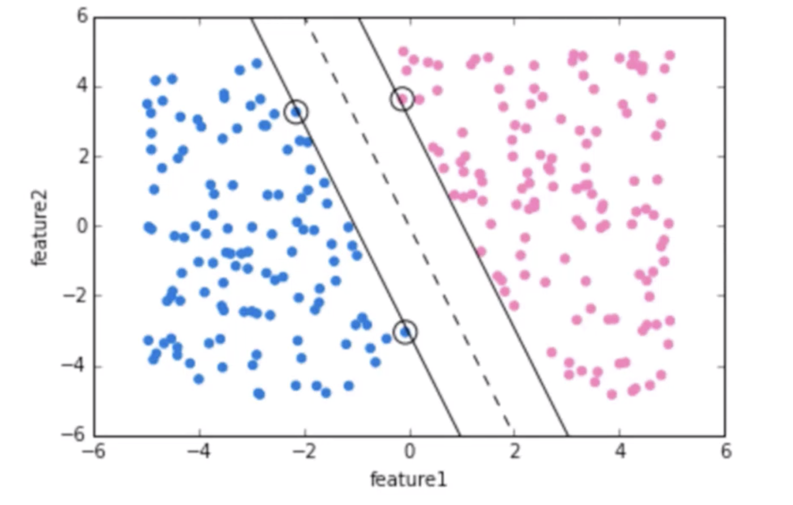
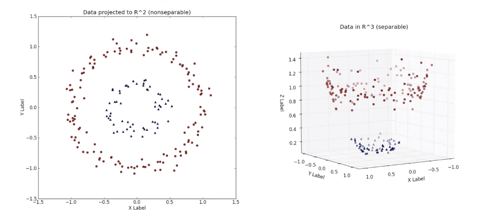
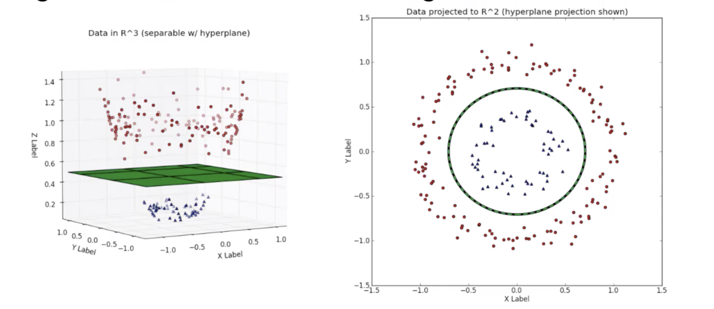

# Support_Vector_Machines
 This project portfolio documents SVM algorithms and project notebook used to train SVM models.

 Support vector machines (SVMs) are supervised learning models with associated learning algorithms that anlayse data and recognise patterns used for classification and regression analysis. See chapter 9 of [Introduction to Statistical Learning](http://faculty.marshall.usc.edu/gareth-james/ISL/ISLR%20Seventh%20Printing.pdf) for more details.

 - When training an SVM model, we always try to choose a **hyperplane** that maximizes the margin between classes.
 - The vector points that the margin lines touch are known as **Support Vectore**

 

- We can expand this idea to non-linear separable data through the "kerneltrick"

- To separete this we will have to view it in a **higher dimension** by looking along the **z-label**

## Project 1: Built-in Breast Cancer Dataset from Scikit-learn
- This project utilises SVM to predict whether a tumor is malignant or benign.

## GridSearch 
**GridSearch** is used to create a grid of parameters to fully evaluate the best data or parameters that have major impact on the model prediction.

- Using `from sklearn.model_selection import GridSearchCV` to create a grid of parametals where **CV** represents cross-validation.
- The grid of parameters is defined as a dictionary, where the keys are the parameters and values are the settings to be tested.

- **one great advantage of GridSearchCV is that it is a meta-estimator**
- Fit is used to create a loop with cross-validation to find the best parameter combination.
- Onece the best parameter combination is determined, the fit algorithms is run again on all the dataset passed to fit without cross-validation to build a single new model using the best parameter settings.

- **NOTE:**
- **C** is used to control the cost of miscalculations during modal training
- A large **C** values would give a low bias and high variance. The low bias because you penalise the cost of miscalculation
- A low **C** would give a high bias and low variance because the cost of miscalculation is not penalised much.
- **Gamma** parameter has to do with the free parameters of the Gaussian radius basis function (rbf)
- A **small Gamma** simply implies a Gaussian for large variance 
- A **large Gamma** would lead to large bias and low variance in the model.

## Project 2: Iris Flower Dataset 

- This project uses the famous [Iris flower data set](http://en.wikipedia.org/wiki/Iris_flower_data_set). 

The Iris data set is a multivariate data set introduced by Sir Ronald Fisher in the 1936 as an example of discriminant analysis.

- The data set consists of 50 samples from each of three species of Iris (Iris setosa, Iris virginica and Iris versicolor), so 150 total samples. Four features were measured from each sample: **the length and the width of the sepals and petals**, in centimeters.

The three different types are:

## Iris Setosa

- Iris Versicolor
- Iris Virginica

